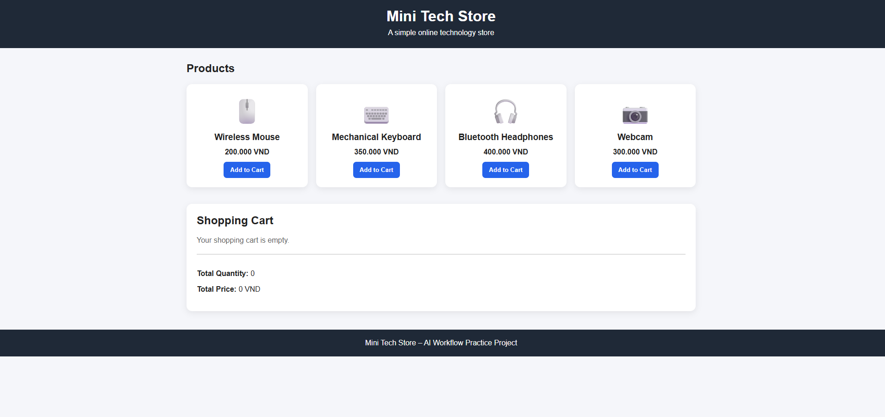
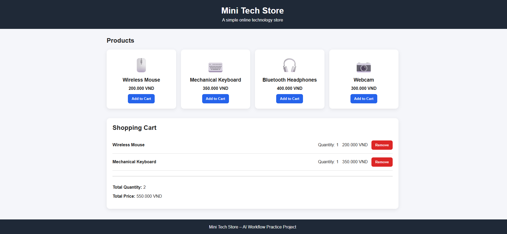

# AI WORKFLOW PRACTICE – MINI TECH STORE

## Student Information

**Student Name:** Doan Hoang Anh  
**Student ID:** 22080003  
**Group:** 4  

---

## 1. Project Overview

This project is a simple online store named **Mini Tech Store**.

The project was created to practice the use of Artificial Intelligence throughout a basic software development workflow:

```text
Requirement → Planning → Design → Coding → Testing → Review
```

The website displays four technology products. Users can add products to a shopping cart, view the total quantity and total price, and remove products from the cart.

The website was developed using:

- HTML
- CSS
- JavaScript
- Visual Studio Code
- GitHub
- GitHub Pages

The project does not use a backend, database, framework, online payment system, or user account.

The purpose of the project is not to create a complete e-commerce platform. Its purpose is to demonstrate how AI can support software development while the student remains responsible for checking and improving the result.

---

## 2. Project Scope

The website includes the following functions:

1. Display four technology products.
2. Display each product's name and price.
3. Add a product to the shopping cart.
4. Increase the quantity when the same product is added again.
5. Display the quantity of each cart item.
6. Display the subtotal of each cart item.
7. Calculate the total quantity.
8. Calculate the total price.
9. Remove a product from the shopping cart.
10. Display a message when the shopping cart is empty.
11. Provide a responsive layout for desktop and mobile screens.

The website does not include:

- User registration
- User login
- Product administration
- A database
- Online payment
- Order processing
- Inventory management
- Delivery management

I intentionally kept the scope small so that I could understand, test, and explain every implemented function.

---

## 3. AI Tools Used

### 3.1. ChatGPT

I used ChatGPT mainly for:

- Understanding the assignment
- Defining the project scope
- Writing functional requirements
- Creating Acceptance Criteria
- Dividing the work into smaller tasks
- Suggesting test cases
- Organizing the project report
- Preparing answers for the presentation

### 3.2. Gemini

I used Gemini mainly for:

- Brainstorming the page layout
- Planning the product section
- Planning the shopping cart section
- Suggesting a simple user workflow
- Comparing simple interface options

### 3.3. Claude

I used Claude mainly for:

- Supporting HTML development
- Supporting CSS development
- Supporting JavaScript development
- Reviewing the shopping cart logic
- Checking duplicate cart items
- Reviewing total-price calculation
- Suggesting improvements to the source code

### 3.4. Development Tools

The following development tools were used:

- Visual Studio Code for writing and reviewing code
- A web browser for running and testing the website
- GitHub for version control and submission
- GitHub Pages for publishing the live website

---

## 4. Requirement Stage

### 4.1. Initial Problem

I wanted to build a small online technology store that could be completed and demonstrated within a short time.

The initial idea was too general:

```text
Create an online store.
```

This requirement was not specific enough because it did not define:

- The number of products
- The required features
- The technologies
- The shopping cart behavior
- The expected results
- The project limitations

### 4.2. Requirement Prompt

I used the following prompt with ChatGPT:

```text
I want to build a small online store in one index.html file.

The website must display four technology products.

Each product must have:
- A product name
- A price
- An Add to Cart button

The shopping cart must:
- Display selected products
- Increase the quantity when the same product is added again
- Display the total quantity
- Display the total price
- Allow users to remove a product

Do not use:
- A backend
- A database
- A framework
- External libraries
- Online payment

Please provide:
1. Functional requirements
2. Non-functional requirements
3. User stories
4. Acceptance criteria
5. Test cases
```

### 4.3. AI Result

ChatGPT suggested several useful functions, including:

- Product display
- Add-to-cart behavior
- Duplicate-product handling
- Quantity calculation
- Total-price calculation
- Product removal
- Responsive design
- Empty-cart notification

The AI also suggested additional features such as login, product search, payment, and order management.

### 4.4. My Decision

I removed the extra features because they were outside the scope of this practice project.

I kept only the features that I could:

- Implement
- Run
- Test
- Understand
- Explain to the lecturer

This step showed that AI can suggest ideas, but the student must decide which requirements are realistic and appropriate.

---

## 5. Functional Requirements

### FR01 – Product Display

The system must display four technology products.

Each product must include:

- Product name
- Product price
- Product icon
- Add to Cart button

### FR02 – Add to Cart

When the user clicks **Add to Cart**, the selected product must be added to the shopping cart.

### FR03 – Duplicate Product Handling

If the selected product already exists in the cart, the system must increase its quantity instead of creating another cart row.

### FR04 – Item Quantity

The system must display the quantity of each product in the shopping cart.

### FR05 – Item Subtotal

The system must calculate each item subtotal using:

```text
Item Subtotal = Product Price × Quantity
```

### FR06 – Total Quantity

The system must calculate the total number of products in the shopping cart.

### FR07 – Total Price

The system must calculate the total price of all products in the shopping cart.

### FR08 – Remove Product

The user must be able to remove a product from the shopping cart.

After a product is removed, the total quantity and total price must be updated.

### FR09 – Empty Cart Message

If the cart contains no products, the system must display:

```text
Your shopping cart is empty.
```

### FR10 – Responsive Layout

The website must remain usable on both desktop and mobile screens.

---

## 6. Non-Functional Requirements

### NFR01 – Usability

The interface should be simple and easy to understand.

### NFR02 – Performance

The page and shopping cart should update immediately after each user action.

### NFR03 – Maintainability

The JavaScript code should be divided into clear functions.

### NFR04 – Compatibility

The website should work on common modern browsers.

### NFR05 – Responsiveness

The product cards and shopping cart should adapt to smaller screens.

### NFR06 – Simplicity

The project should not require installation, a server, or a database.

---

## 7. Acceptance Criteria

The website is accepted when:

1. Four products are displayed.
2. Each product has a name, price, icon, and button.
3. Clicking Add to Cart adds the correct product.
4. Adding the same product twice creates one cart row with quantity two.
5. Adding different products creates different cart rows.
6. The total quantity is correct.
7. The total price is correct.
8. Removing a product updates the cart.
9. Removing all products displays the empty-cart message.
10. No JavaScript error is displayed in the browser console.
11. The website remains usable on a mobile-sized screen.

---

## 8. Planning Stage

### 8.1. Planning Prompt

I used the following prompt:

```text
Divide the development of Mini Tech Store into small steps.

The project must use only HTML, CSS, and JavaScript in one index.html file.

The project functions are:
1. Display four products
2. Add products to the cart
3. Increase quantity for duplicate products
4. Calculate total quantity
5. Calculate total price
6. Remove products
7. Test the project

Create a simple step-by-step development plan.
```

### 8.2. Development Plan

The work was divided into the following steps:

1. Define the product data.
2. Create the page structure.
3. Create the product-card design.
4. Display the products using JavaScript.
5. Create an empty shopping cart.
6. Add the Add to Cart function.
7. Handle duplicate products.
8. Calculate item subtotals.
9. Calculate total quantity.
10. Calculate total price.
11. Add the Remove function.
12. Add responsive CSS.
13. Perform manual testing.
14. Review and improve the source code.
15. Upload the project to GitHub.

### 8.3. My Evaluation

The AI initially suggested creating several separate pages.

I decided to use only one `index.html` file because:

- It is easier to understand.
- It is easier to upload.
- It is easier to demonstrate.
- It reduces file-linking errors.
- It is suitable for the size of this practice project.

---

## 9. Design Stage

### 9.1. Design Prompt

I used the following prompt with Gemini:

```text
Suggest a simple layout for Mini Tech Store.

The page must include:
1. Store title
2. Four products
3. Product name
4. Product price
5. Add to Cart button
6. Shopping cart
7. Total quantity
8. Total price

The shopping cart should be displayed below the products.

Only describe the layout. Do not create code.
```

### 9.2. AI Suggestion

Gemini suggested the following workflow:

```text
Store Header
↓
Product List
↓
Shopping Cart
↓
Total Quantity and Total Price
↓
Footer
```

### 9.3. Final Design Decision

I selected a simple layout:

- A header at the top
- Four product cards in a grid
- A shopping cart below the products
- A total section below the cart
- A footer at the bottom

I did not add a menu, banner, search field, or product-detail page because these elements were unnecessary for the selected project scope.

---

## 10. Coding Stage

### 10.1. First Coding Prompt

I used Claude to support the first coding step:

```text
Create one index.html file for Mini Tech Store.

Requirements:
1. Use HTML, CSS, and JavaScript in the same file.
2. Display four technology products.
3. Each product must have a name, price, and Add to Cart button.
4. Do not create the shopping cart yet.
5. Keep the code simple and easy to explain.
```

I first ran the product-display section before adding any shopping-cart functions.

### 10.2. Second Coding Prompt

After the products were displayed correctly, I used another prompt:

```text
Add a shopping cart to the current index.html file.

Requirements:
1. Add the selected product to the cart.
2. If the product already exists, increase its quantity.
3. Do not create duplicate rows for the same product.
4. Display product name, quantity, and subtotal.
5. Add a Remove button.
6. Display total quantity.
7. Display total price.
8. Do not rewrite unrelated code.
9. Explain the added JavaScript functions.
```

### 10.3. Main JavaScript Functions

The final project contains the following main functions:

```text
formatCurrency()
renderProducts()
addToCart()
removeFromCart()
calculateTotals()
renderCart()
```

### 10.4. What Each Function Does

#### `formatCurrency()`

Formats a number as Vietnamese currency.

#### `renderProducts()`

Displays all products on the page.

#### `addToCart()`

Adds the selected product to the cart.

If the product already exists, the function increases the quantity.

#### `removeFromCart()`

Removes the selected product from the cart.

#### `calculateTotals()`

Calculates:

- Total quantity
- Total price

#### `renderCart()`

Displays the current shopping cart and updates the totals.

---

## 11. Problems Found in AI-Generated Results

### 11.1. Duplicate Cart Rows

One possible initial approach was to push a product into the cart every time the button was clicked.

This could create several rows for the same product.

The corrected approach checks whether the product already exists:

```text
If the item exists:
    Increase quantity
Otherwise:
    Add a new cart item
```

### 11.2. Incorrect Total Updating

The total must be recalculated after every change.

I verified that `renderCart()` calls the total calculation after:

- Adding a product
- Increasing quantity
- Removing a product

### 11.3. Excessive Project Scope

AI suggested additional features such as:

- Login
- Search
- Payment
- Database
- Administration

I removed these features because they were not required for demonstrating the AI Workflow.

### 11.4. Unnecessary Complexity

Some AI suggestions used multiple JavaScript classes and separate modules.

I selected simpler functions because the project is small and must be easy to explain.

---

## 12. Testing Stage

### 12.1. Testing Method

I used manual testing in a web browser.

I did not simply ask AI whether the code was correct.

I performed actual actions and compared the actual result with the expected result.

### 12.2. Test Cases

Complete the **Actual Result** and **Status** columns only after testing the live website.

| Test ID | Test Action | Expected Result | Actual Result | Status |
|---|---|---|---|---|
| TC01 | Open the website | Four products are displayed | To be completed | PASS/FAIL |
| TC02 | Add Wireless Mouse | Mouse appears with quantity 1 | To be completed | PASS/FAIL |
| TC03 | Add Wireless Mouse again | One mouse row appears with quantity 2 | To be completed | PASS/FAIL |
| TC04 | Add Mechanical Keyboard | Keyboard appears in a new row | To be completed | PASS/FAIL |
| TC05 | Check total quantity | Total quantity matches all selected products | To be completed | PASS/FAIL |
| TC06 | Check total price | Total price matches manual calculation | To be completed | PASS/FAIL |
| TC07 | Remove Wireless Mouse | Mouse is removed and totals are updated | To be completed | PASS/FAIL |
| TC08 | Remove all products | Empty-cart message is displayed | To be completed | PASS/FAIL |
| TC09 | Open browser console | No JavaScript error is displayed | To be completed | PASS/FAIL |
| TC10 | Test mobile screen | Page remains readable and usable | To be completed | PASS/FAIL |

### 12.3. Manual Price Calculation

Example:

```text
Wireless Mouse:
200,000 VND × 2 = 400,000 VND

Mechanical Keyboard:
350,000 VND × 1 = 350,000 VND

Expected Total:
750,000 VND
```

Website result:

```text
Complete this after performing the test.
```

### 12.4. Testing Rule

I only mark a test as `PASS` after the actual result matches the expected result.

If a test fails, I record the issue, correct the code, and repeat the test.

---

## 13. Review Stage

### 13.1. Review Prompt

I used the following review prompt:

```text
Review the Mini Tech Store index.html file.

Check:
1. Code readability
2. Function names
3. Duplicate code
4. Duplicate cart-item logic
5. Total-quantity calculation
6. Total-price calculation
7. Product removal
8. Empty-cart handling
9. Browser-console errors
10. Responsive design

Do not rewrite the complete project.

List:
- The issue
- Why it is a problem
- The smallest recommended correction
```

### 13.2. Review Checklist

Before submitting, I check:

- The website displays four products.
- Every Add to Cart button works.
- Duplicate products increase quantity.
- Total quantity is correct.
- Total price is correct.
- Remove buttons work.
- The empty-cart message appears.
- No JavaScript error appears.
- The mobile layout works.
- The repository is public.
- GitHub Pages is active.
- The README matches the actual product.

### 13.3. Human Review

I did not automatically accept every AI suggestion.

I accepted only changes that:

- I understood
- Matched the requirements
- Worked in the browser
- Passed the test cases
- Did not make the project unnecessarily complex

---

## 14. Practical Verification

The practical verification process was:

```text
1. Open index.html
2. Check the four products
3. Add one product
4. Add the same product again
5. Check the quantity
6. Add another product
7. Calculate the expected price manually
8. Compare it with the website
9. Remove a product
10. Remove all products
11. Check the empty-cart message
12. Check the browser console
13. Test the mobile layout
```

This process provides stronger evidence than only asking AI whether the code is correct.

---

## 15. Answers to the Lecturer's Questions

### 15.1. At Which Stage Did AI Help You the Most?

AI helped me the most during the Requirement and initial Coding stages.

During Requirement analysis, AI helped transform a general idea into specific functions and Acceptance Criteria.

During Coding, AI helped create the first version of the product cards and shopping-cart functions.

However, I still had to run and test the code before accepting the result.

### 15.2. Where Did AI Produce an Incorrect or Inappropriate Result?

AI sometimes suggested functions that were outside the project scope, such as login, payment, search, and a database.

In coding, an incorrect approach could add the same product to several cart rows instead of increasing its quantity.

AI also sometimes suggested code that was more complex than necessary for a small project.

### 15.3. How Did You Check and Modify the AI Result?

I checked the result by:

1. Reading the code.
2. Running the website.
3. Clicking every button.
4. Adding the same product several times.
5. Calculating the total price manually.
6. Removing products.
7. Checking the browser console.
8. Testing the mobile layout.
9. Comparing the result with the Acceptance Criteria.
10. Repeating the tests after making changes.

### 15.4. What Should Be the Roles of Humans and AI?

AI should support:

- Idea generation
- Requirement analysis
- Initial code generation
- Test-case suggestions
- Error explanations
- Code-review suggestions

Humans should:

- Define the real problem
- Decide the project scope
- Provide relevant context
- Understand the code
- Test the product
- Evaluate security and quality
- Make final decisions
- Take responsibility for the result

AI should be treated as a development assistant, not as a replacement for human responsibility.

---

## 16. Project Links


**Live Website:**

```text
(https://doan-hoanganh.github.io/BAITAPTUHOC2/)```

---

```
## Website



